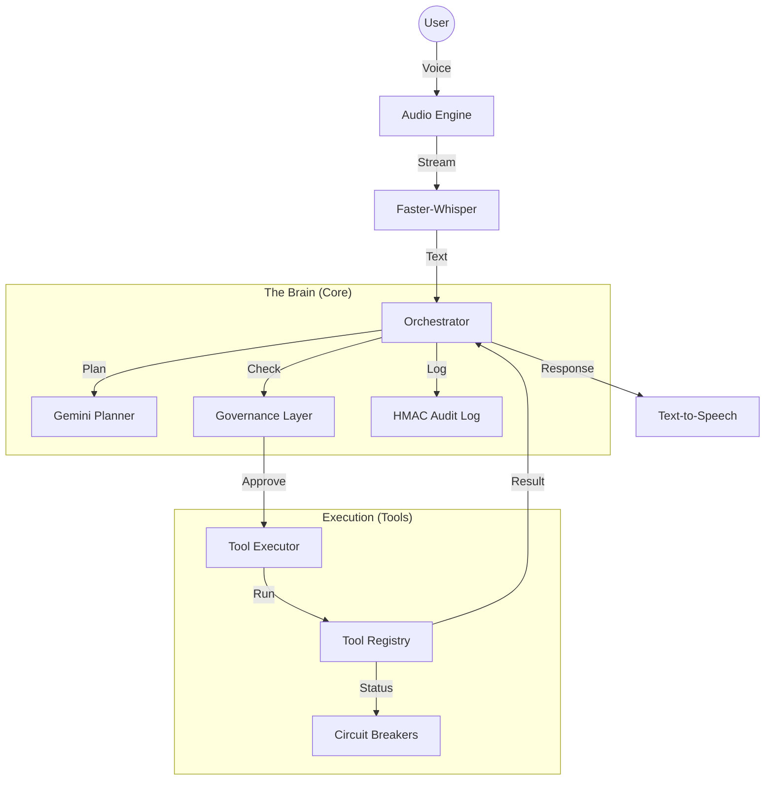

<div align="center">

# J.A.R.V.I.S.
### Voice-Driven Automation System v1.0.0

[](CHANGELOG.md)
[](pyproject.toml)
[](LICENSE)
[](tests/)
[](IDENTITY.md)

> **A forensic-grade, trust-first personal AI assistant with explicit governance, accountability, and reliability guarantees.**

*Built for users who ask: "Can I prove what this AI did?"*

[Features](#-features) • [Installation](#-quick-start) • [The Trust Stack](#-the-trust-stack) • [Documentation](#-documentation)

</div>

---

## 📜 Philosophy

> **JARVIS prioritizes correctness, traceability, and user authority over speed, autonomy, or convenience.**

Most assistants aim for "magic." JARVIS aims for **proof**. It is designed to be:
- **Auditable**: Every action is cryptographically logged.
- **Governed**: No tool runs without explicit permission.
- **Reliable**: Failures are contained, never cascaded.

---

## ✨ Features

### 🧠 Intelligence & Interaction
| Feature | Details |
|---------|---------|
| 🎤 **Voice Control** | Low-latency **Faster-Whisper** engine with push-to-talk. |
| � **Smart Planning** | **Gemini LLM** orchestration with automatic mock fallback. |
| � **Multimodal Vision** | Analyze screenshots and camera feeds in real-time. |
| � **Contextual Memory** | Remembers conversation history and user preferences. |
| ⏰ **Automation** | Event-driven scheduler for deferred tasks. |

### 🛡️ The Trust Stack (v1.0 Guarantees)
JARVIS is built on four immutable layers of trust.

#### 1. Governance (v0.6.0)
*You control exactly what the AI can do.*
- **Explicit Grants**: Zero-trust architecture. Tools are denied by default.
- **Auto-Revocation**: Permissions expire automatically after a set time.
- **Confirmation Gates**: Dangerous tools (WRITE/EXECUTE) require human approval.

#### 2. Accountability (v0.7.0)
*You can prove exactly what happened.*
- **HMAC Audit Chain**: Tamper-evident, cryptographic log of every action.
- **Full Traceability**: Every tool execution is linked to a specific user turn (`turn_id`).
- **Verifiable identity**: Decisions are permanently recorded.

#### 3. Reliability (v0.8.0)
*The system fails safely.*
- **Circuit Breakers**: A failing tool cannot crash the system.
- **Failure Budgets**: Execution is aborted if error rates exceed safe thresholds.
- **Graceful Degradation**: Policies define fallback behavior (Fast Fail vs Retry).

#### 4. Stability (v0.9.0)
*The contract is binding.*
- **Frozen API**: Public surfaces are stable.
- **Strict Configuration**: Unknown settings cause startup errors.
- **Semantic Versioning**: Breaking changes require a MAJOR version bump.

---

## 🚀 Quick Start

### Requirements
- Python 3.10+
- macOS (for native system integrations)
- `ffmpeg` (for audio processing)

### Installation
```bash
# 1. Clone the repository
git clone https://github.com/itzAditya0/JARVIS.git
cd JARVIS

# 2. Install dependencies
poetry install

# 3. Configure environment
cp .env.example .env
# Edit .env to add GEMINI_API_KEY (optional) and JARVIS_AUDIT_KEY (recommended)
```

### Running
```bash
# Standard Voice Mode (Phase 4)
poetry run python main.py

# Text-Input Mode (for testing without microphone)
poetry run python main.py --test

# Offline/Mock Mode (no API key needed)
poetry run python main.py --mock-llm
```

---

## 🗣️ Usage

### Voice Commands
| Command Categories | Examples |
|--------------------|----------|
| **Information** | "What time is it?", "What is today's date?" |
| **Multimodal** | "Take a screenshot", "Take a photo" |
| **System** | "Open Spotify", "Increase volume", "Mute system" |
| **Research** | "Search for Python error handling patterns" |
| **Automation** | "Schedule a meeting reminder for 9 AM" |

### Available Tools
Permissions are managed in `config/permissions.yaml`.

| Tool | Permission Level | Capability |
|------|------------------|------------|
| `get_current_time` | 🟢 READ | Read system clock |
| `web_search` | 🟡 NETWORK | External HTTP requests |
| `open_application` | 🔴 EXECUTE | Launch local processes |
| `read_file` | 🟢 READ | Access filesystem (read-only) |
| `take_screenshot` | 🟢 READ | Capture screen buffer |
| `schedule_task` | 🔴 EXECUTE | Register deferred events |

---

## 📚 Documentation

Detailed documentation for the "forensic-grade" architecture:

| Document | Description |
|----------|-------------|
| [**IDENTITY.md**](IDENTITY.md) | **The Core Manifesto**. Identity, audience, and philosophy. |
| [**INVARIANTS.md**](INVARIANTS.md) | **The Promises**. Binding system guarantees by version. |
| [**API.md**](API.md) | **The Contract**. Stable public API surface. |
| [**VERSIONING.md**](VERSIONING.md) | **The Rules**. Policy for breaking changes. |
| [**CHANGELOG.md**](CHANGELOG.md) | **The History**. Version evolution. |

---

## 🏗️ Architecture



### Security Details
- **Default Deny**: All unknown tools are blocked.
- **No Shell Access**: Subprocesses run without `shell=True`.
- **Allowlists**: Application launching is restricted to known safe apps.
- **Tamper-Evident**: Audit logs use HMAC chaining (`HMAC(previous_hash + current_entry)`).

---

## 📄 License

This project is licensed under the **MIT License**. See [LICENSE](LICENSE) for details.

---

<div align="center">

**[JARVIS v1.0.0](https://github.com/itzAditya0/JARVIS)**
<br>
*"An AI assistant you can audit, correct, and trust."*

</div>
